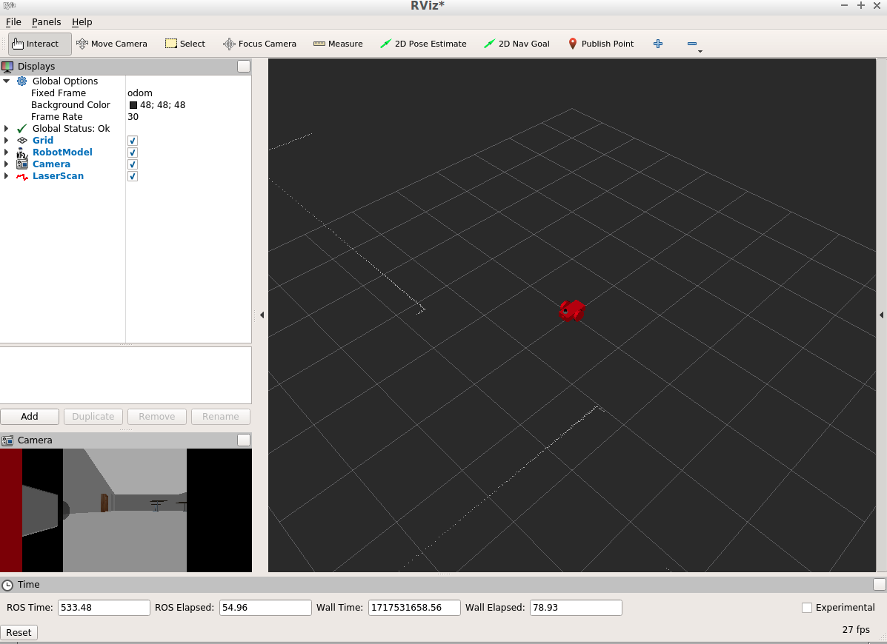
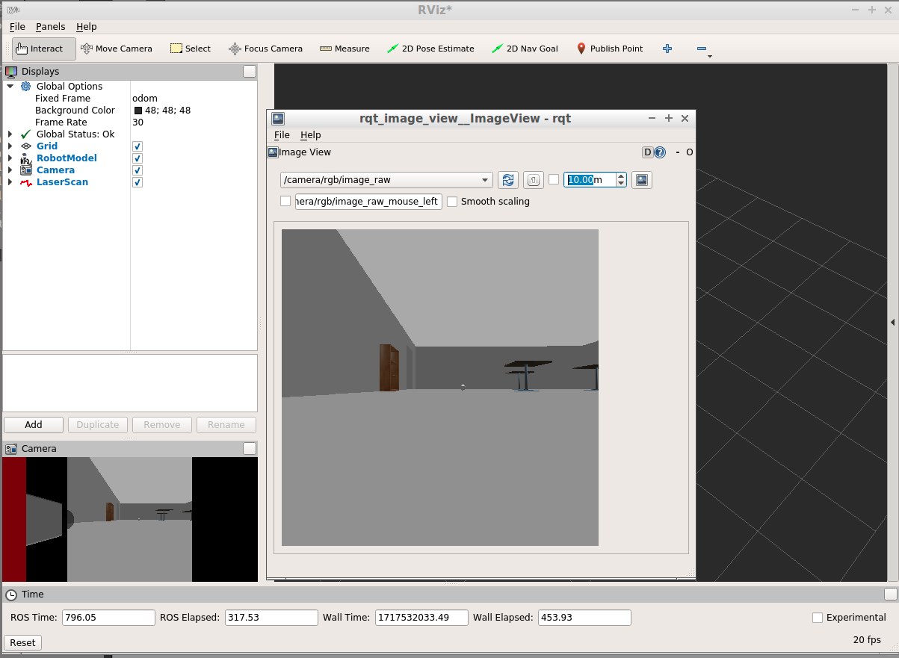
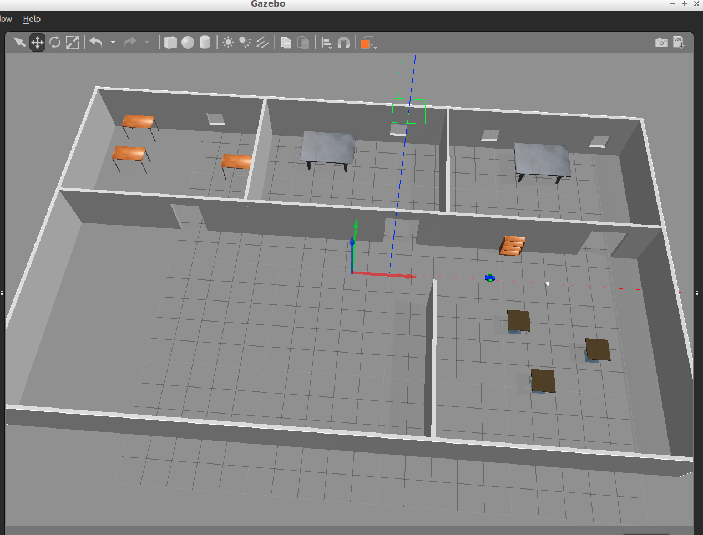

## Folder Structure
```
ball_chase
   |-- .catkin_workspace
   |-- README.md
   |-- screenshot
   |   |-- ball_in_view.png
   |   |-- gazebo.png
   |   |-- original_rviz.png
   |   |-- robot_moving_to_ball.png
   |-- src
   |   |-- CMakeLists.txt
   |   |-- ball_chaser
   |   |   |-- CMakeLists.txt
   |   |   |-- launch
   |   |   |   |-- ball_chaser.launch
   |   |   |-- package.xml
   |   |   |-- src
   |   |   |   |-- drive_bot.cpp
   |   |   |   |-- process_image.cpp
   |   |   |-- srv
   |   |   |   |-- DriveToTarget.srv
   |   |-- my_robot
   |   |   |-- CMakeLists.txt
   |   |   |-- launch
   |   |   |   |-- robot_description.launch
   |   |   |   |-- world.launch
   |   |   |-- meshes
   |   |   |   |-- hokuyo.dae
   |   |   |-- package.xml
   |   |   |-- urdf
   |   |   |   |-- my_robot.gazebo
   |   |   |   |-- my_robot.xacro
   |   |   |-- worlds
   |   |   |   |-- empty.world
   |   |   |   |-- office.world

```

## Compile 
```console
$ mkdir build
$ catkin_make
```

## Run 
```console
$ source devel/setup.bash
$ roslaunch my_robot world.launch
$ roslaunch ball_chaser ball_chaser.launch
$ rosrun rqt_image_view rqt_image_view
```

## Result
Initially, the white ball is beyond the camera view.



After dragging the white ball to camera's view, the robot can move to the ball succesfully. 


