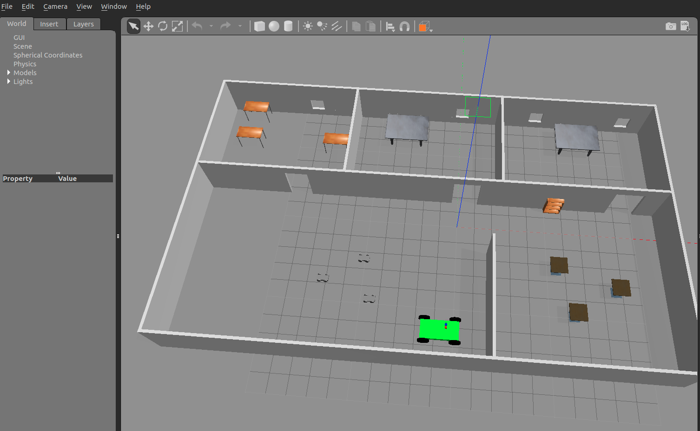
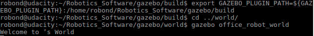

## Folder Structure
```
gazebo
   |-- .gitignore
   |-- CMakeLists.txt
   |-- README.md
   |-- model
   |   |-- office
   |   |   |-- model.config
   |   |   |-- model.sdf
   |   |-- robot
   |   |   |-- model.config
   |   |   |-- model.sdf
   |-- screenshot
   |   |-- gazebo.png
   |   |-- terminal.png
   |-- script
   |   |-- welcome_message.cpp
   |-- world
   |   |-- office_robot_world
   |   |-- office_world
   |   |-- robot_world
```

## Compile 
```console
$ mkdir build
$ cd build
$ cmake ../
$ make
$ export GAZEBO_PLUGIN_PATH=${GAZEBO_PLUGIN_PATH}:/home/robond/Robotics_Software/gazebo/build
```

## Result


